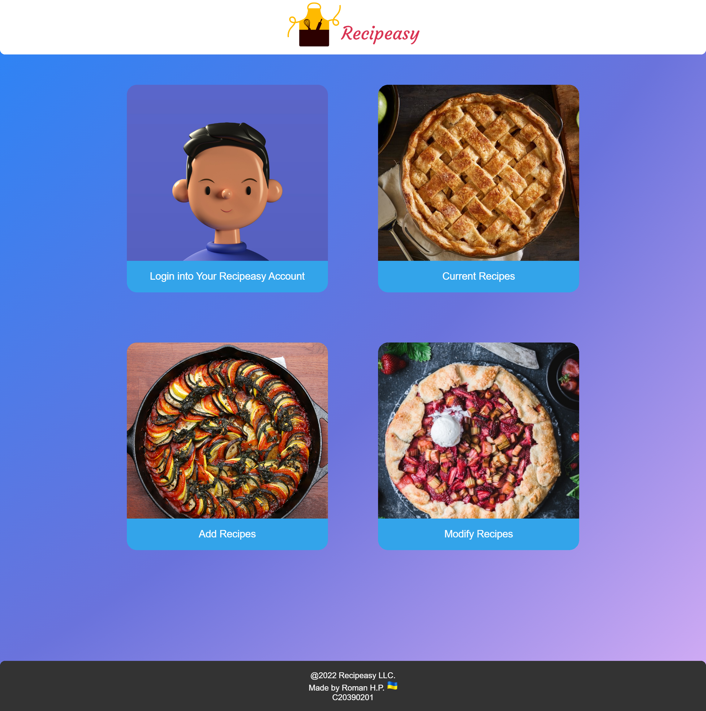

# Recipeasy
PHP / MySQL / HTML5 + CSS3 Assignment for Web Development Yr 2 Sem 2
By Roman Holub Ploshko
C20390201

----------------------------------------------------------

## Web System Goals:

Perform CRUD Operations:

Create a Recipe

Read Recipe(s)

Update Recipe(s)

Delete a Recipe

Implement a User Sign-Up / Login & Logout System 

## General order of web transactions:

- User Signs Up for a Recipeasy Account
- User Logins In
- End User Views Current Recipes
- End User Adds a Recipe
- End User - Modifies a selected Recipe - Update / Delete
- User has the option to Log out at any stage after successfully logging in

 ----------------------------------------------------------
 
## Included PHP Files & their Description:

\includes\

	-add_recipes.inc.php
               An included process - used to accept a Form & excecute prepared SQL Insert statement to add a Recipe to the 'recipe' table in the recipeasy Database.
               
	-dbh.inc.php
           DataBase Handler is used to establish a connection with the database. 
           
	-login.inc.php
         Calls signup_functions.inc.php - where verification of inputted user credentials takes place.
         
	-logout.inc.php
          Destroys session - set with User ID.
          
	-modifyrecipes.inc.php
                Holds 2 Updates and 1 Delete SQL statement, accepted by form submissions, In 1st Update - Recipe ID is stored is session - to be later process selected options.
                
    -signup_functions.inc.php
                    Holds many built-in PHP Functions used for Error Handling during Signup & Login process - Creates an account (if submitted form passed error check) & has a function to Verify user credentials and log user into the site.
                    
	-signup.inc.php
          Calls built-in PHP functions found in signup_functions.inc.php - in attempt to create a new Recipeasy account and store crediential in the database - later used with login.

.\

  	-addrecipes.php
             Form to input data on a Recipe - to create it.
             
	-currentrecipes.php
                  Display Recipes in the database - using an associative array.
                  
	-footer.php
         A Footer with JavaScript - to automatically update Current Year.
          
	-header.php
          Header with Recipeasy Logo - that is a link to the index page.
          
	-index.php
         Main Menu with card links to CRUD Functionality & User Authentification.
  
	-modifyrecipes.php
                 Form to choose what Recipe to Update OR Delete.
                 
	-modifyrecipesselected.php
                        Above selected Recipe is displayed in a Form, the user has the ability to edit displayed Recipe Data.
                        
	-myaccount_login.php
                  Form used to Log User in.
                  
	-myaccount_profile.php
                    After User Logs in - this page opens after choosing My Account, an option to Log out is displayed.
                    
	-myaccount_signup.php
                    Link to this option appears below Login Form.
    
	-style.css
      StyleSheet
      
 ----------------------------------------------------------
 
 ## Links
  
 [Outlook](mailto:C20390201@mytudublin.ie)
 
 [Github](https://github.com/romanh01/)
 
  ----------------------------------------------------------
  
  ## License
  
  Licensed under the [MIT License](LICENSE)
  
  
